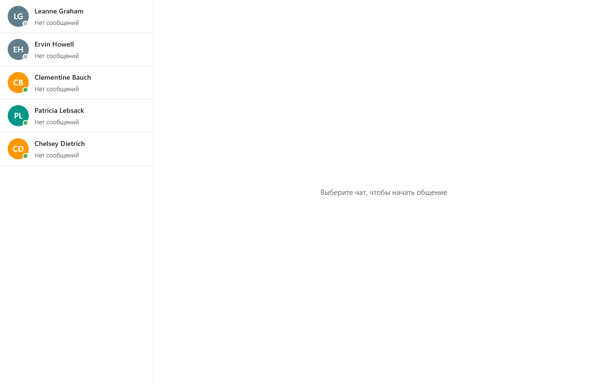
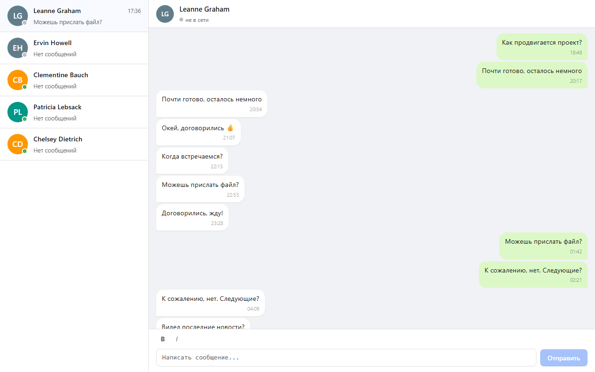
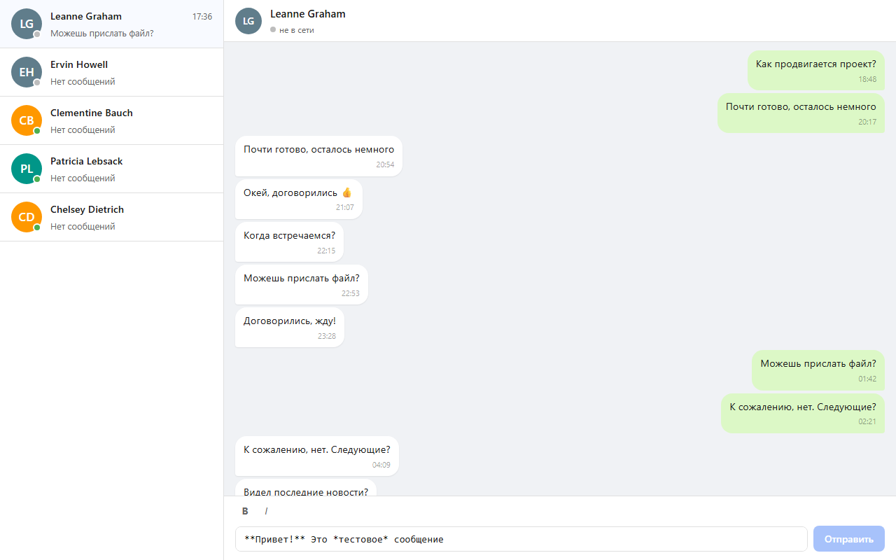
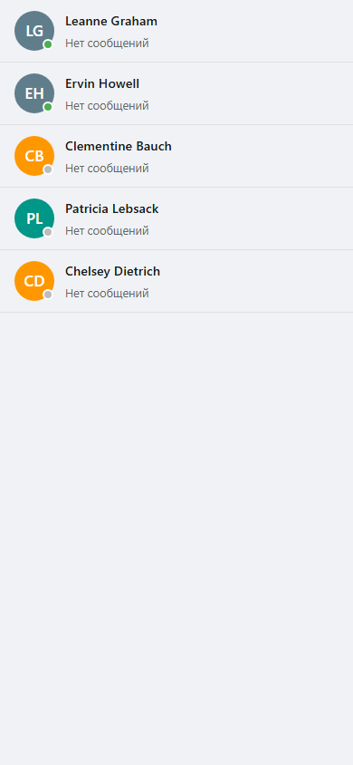

# Vue Messenger

SPA-мессенджер на Vue 3 + TypeScript + Pinia.

## Скриншоты

### Десктоп

| Список чатов | Открытый чат | Ввод сообщения |
|---|---|---|
|  |  |  |

### Мобильный

| Список чатов | Открытый чат |
|---|---|
|  |  |

## Стек

- **Vue 3** (Composition API, `<script setup>`)
- **TypeScript** (strict, no `any`)
- **Pinia** (Options API) + `pinia-plugin-persistedstate`
- **Vue Router 4**
- **SCSS** с переменными и миксинами
- **Vite**
- **Vitest** + `@vue/test-utils`
- **ESLint** (flat config) + **Prettier**

## Возможности

- Список чатов с аватарами, статусами онлайн/офлайн и счётчиком непрочитанных
- История сообщений (20–30 случайных сообщений при первом открытии)
- Отправка сообщений с автоответом через 1–2 секунды
- Форматирование текста: **жирный** (`**текст**`), *курсив* (`*текст*`), Ctrl+B / Ctrl+I
- Автопрокрутка к последнему сообщению
- Анимация появления новых сообщений
- Адаптивная вёрстка (мобильный / десктоп)
- Сохранение данных в `localStorage`

## Запуск

```bash
npm install
npm run dev
```

## Сборка

```bash
npm run build
npm run preview
```

## Тесты

```bash
npm run test:run   # однократный запуск
npm run test       # watch-режим
```

## Линтинг

```bash
npm run lint        # проверка
npm run lint:fix    # автоисправление
npm run format      # Prettier
```

## Архитектура

Подробная документация в папке [`docs/`](./docs/README.md).

```
src/
├── components/
│   ├── chat-list/      # ChatList, ChatListItem
│   ├── chat-window/    # ChatWindow, ChatHeader, MessageList, MessageItem, MessageInput
│   ├── layout/         # AppLayout
│   └── ui/             # BaseButton, BaseAvatar, StatusDot, BaseBadge, BaseTextarea, BaseSpinner
├── composables/        # useBreakpoint, useAutoScroll, useMessageInput
├── services/           # api, messageGenerator, messenger
├── stores/             # usersStore, chatsStore (Pinia Options API)
├── utils/              # textFormatter
├── views/              # ChatListView, ChatView
├── router/             # Vue Router
├── types/              # TypeScript интерфейсы
├── constants/          # Константы приложения
└── styles/             # SCSS переменные, миксины, сброс стилей
```
